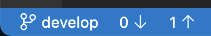

# Status Bar Push and Pull

This extension adds push and pull buttons to the status bar.

It also displays the number of commits that haven't yet been pulled from or pushed to the remote repository.

Tip: If you want to use this extension as a replacement for the Sync button, set `git.enableStatusBarSync` to `false`.
